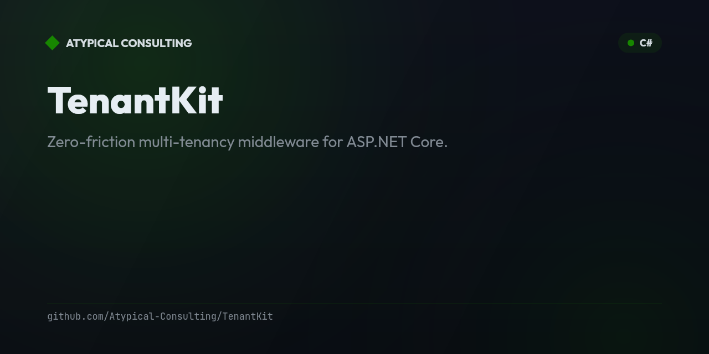

# 🏢 TenantKit

[](https://github.com/Atypical-Consulting/TenantKit/actions/workflows/ci.yml)
[](LICENSE)
[](https://www.nuget.org/packages/TenantKit.Core)
[](https://dotnet.microsoft.com)

**Zero-friction multi-tenancy middleware for ASP.NET Core.**  
Built by [Atypical Consulting](https://atypical.garry-ai.cloud).

---

## Table of Contents

- [The Problem](#the-problem)
- [The Solution](#the-solution)
- [Features](#features)
- [Tech Stack](#tech-stack)
- [Packages](#packages)
- [Quick Start](#quick-start)
- [Available Resolvers](#available-resolvers)
- [Core Contracts](#core-contracts)
- [Architecture](#architecture)
- [Project Structure](#project-structure)
- [Roadmap](#roadmap)
- [Stats](#stats)
- [Contributing](#contributing)
- [License](#license)

---

## The Problem

Every .NET SaaS application hits the multi-tenancy wall sooner or later.  
Existing solutions like **Finbuckle.MultiTenant** are powerful but heavy — they're deeply coupled to Entity Framework, assume you want per-tenant databases, and require significant configuration before you get a tenant in scope.

You shouldn't need to fight your framework to know *who's asking*.

---

## The Solution

**TenantKit** resolves the current tenant in 3 lines:

```csharp
// Program.cs
builder.Services.AddTenantKit(tk => tk
    .UseHeaderResolver()
    .UseQueryStringResolver()
    .WithInMemoryStore(s => {
        s.Add(new Tenant { Id = "acme", Name = "Acme Corp" });
        s.Add(new Tenant { Id = "globex", Name = "Globex Inc." });
    }));

app.UseTenantKit();
```

Then inject `ITenantContext` anywhere:

```csharp
app.MapGet("/hello", (ITenantContext ctx) =>
    $"Hello from tenant: {ctx.CurrentTenant?.Name ?? "unknown"}");
```

---

## Features

- [x] Header-based tenant resolution (`X-Tenant-Id`)
- [x] Query string tenant resolution (`?tenantId=`)
- [x] Subdomain-based tenant resolution
- [x] JWT/cookie claim-based tenant resolution
- [x] Route value tenant resolution
- [x] Composite resolver (try multiple strategies in order)
- [x] In-memory tenant store
- [x] Scoped per-request `ITenantContext`
- [x] Fluent builder API for configuration
- [x] Custom `ITenantStore` support (bring your own data source)
- [x] Custom `ITenantResolver` support
- [x] Typed exceptions (`TenantNotFoundException`, `TenantResolutionException`)
- [ ] EF Core integration *(planned)*
- [ ] Redis-backed distributed tenant store *(planned)*
- [ ] Per-tenant rate limiting *(planned)*
- [ ] Per-tenant configuration overrides *(planned)*

## Tech Stack

| Layer | Technology |
|-------|-----------|
| Runtime | .NET 10.0 |
| Framework | ASP.NET Core |
| Language | C# 13 |
| Testing | xUnit |
| CI | GitHub Actions |

---

## Packages

| Package | Description | NuGet |
|---------|-------------|-------|
| `TenantKit.Core` | Contracts + InMemoryTenantStore | [](https://www.nuget.org/packages/TenantKit.Core) |
| `TenantKit.AspNetCore` | Middleware, resolvers, DI extensions | [](https://www.nuget.org/packages/TenantKit.AspNetCore) |

---

## Quick Start

### Install

```bash
dotnet add package TenantKit.AspNetCore
```

### Configure

```csharp
builder.Services.AddTenantKit(tk => tk
    .UseHeaderResolver()          // X-Tenant-Id header
    .UseQueryStringResolver()     // ?tenantId=acme
    .WithInMemoryStore(s => {
        s.Add(new Tenant { Id = "acme", Name = "Acme Corp" });
    }));

app.UseTenantKit();
```

### Use

```csharp
// In a controller or minimal API
public class OrdersController : ControllerBase
{
    public OrdersController(ITenantContext tenantContext) { ... }

    [HttpGet]
    public IActionResult Get()
    {
        var tenant = _tenantContext.CurrentTenant;
        // Filter data by tenant.Id
    }
}
```

---

## Available Resolvers

| Resolver | Looks at | Example |
|----------|----------|---------|
| `HeaderTenantResolver` | `X-Tenant-Id` request header | `X-Tenant-Id: acme` |
| `QueryStringTenantResolver` | `tenantId` query param | `?tenantId=acme` |
| `SubdomainTenantResolver` | First subdomain segment | `acme.myapp.com` |
| `ClaimTenantResolver` | JWT/cookie claim | `tenant_id` claim |
| `RouteValueTenantResolver` | Route parameter | `/{tenantId}/orders` |
| `CompositeTenantResolver` | Try resolvers in order | First non-null wins |

Configure multiple resolvers — they're tried in registration order:

```csharp
builder.Services.AddTenantKit(tk => tk
    .UseHeaderResolver()
    .UseSubdomainResolver()
    .UseClaimResolver(claimType: "tenant_id")
    .WithInMemoryStore(...));
```

---

## Core Contracts

```csharp
public interface ITenant
{
    string Id { get; }
    string Name { get; }
}

public interface ITenantStore
{
    Task<ITenant?> FindByIdAsync(string tenantId, CancellationToken ct = default);
    Task<IReadOnlyList<ITenant>> GetAllAsync(CancellationToken ct = default);
}

public interface ITenantContext
{
    ITenant? CurrentTenant { get; }
}
```

---

## Architecture

```
Request
  │
  ▼
TenantMiddleware
  │  calls resolvers in order
  ├─► HeaderTenantResolver
  ├─► QueryStringTenantResolver
  └─► ... (first non-null tenantId wins)
       │
       ▼
    ITenantStore.FindByIdAsync(tenantId)
       │
       ▼
    HttpTenantContext (scoped, per-request)
       │
       ▼
Downstream handlers / controllers / services
```

---

## Project Structure

```
TenantKit/
├── src/
│   ├── TenantKit.Core/
│   │   ├── ITenant.cs
│   │   ├── ITenantStore.cs
│   │   ├── ITenantContext.cs
│   │   ├── ITenantResolver.cs
│   │   ├── Tenant.cs
│   │   ├── InMemoryTenantStore.cs
│   │   ├── TenantNotFoundException.cs
│   │   └── TenantResolutionException.cs
│   └── TenantKit.AspNetCore/
│       ├── Resolvers/
│       │   ├── HeaderTenantResolver.cs
│       │   ├── QueryStringTenantResolver.cs
│       │   ├── SubdomainTenantResolver.cs
│       │   ├── ClaimTenantResolver.cs
│       │   ├── RouteValueTenantResolver.cs
│       │   └── CompositeTenantResolver.cs
│       ├── TenantMiddleware.cs
│       ├── HttpTenantContext.cs
│       ├── TenantKitBuilder.cs
│       ├── TenantKitOptions.cs
│       ├── ServiceCollectionExtensions.cs
│       └── ApplicationBuilderExtensions.cs
├── tests/
│   └── TenantKit.Tests/         # 24/24 tests passing ✅
└── samples/
    └── TenantKit.Demo/          # Minimal API sample
```

---

## Roadmap

- [ ] **EF Core integration** — `TenantKit.EntityFrameworkCore` — per-tenant DbContext factory
- [ ] **Redis cache** — `TenantKit.Redis` — distributed tenant store backed by Redis
- [ ] **Per-tenant rate limiting** — `TenantKit.RateLimiting` — ASP.NET Core rate limiter integration
- [ ] **Per-tenant configuration** — override `IConfiguration` per tenant
- [ ] **NuGet publish** — to nuget.org once API is stable

---

## Stats

<!-- Get your hash from https://repobeats.axiom.co -->


---

## Contributing

Contributions are welcome! Please open an issue first for large changes.

1. Fork the repository
2. Create your feature branch (`git checkout -b feature/amazing-feature`)
3. Commit using [conventional commits](https://www.conventionalcommits.org/) (`git commit -m 'feat: add amazing feature'`)
4. Push to the branch (`git push origin feature/amazing-feature`)
5. Open a Pull Request

---

## License

[MIT](LICENSE) © 2026 [Atypical Consulting](https://atypical.garry-ai.cloud)

---

Built with care by [Atypical Consulting](https://atypical.garry-ai.cloud) — opinionated, production-grade open source.

[](https://github.com/Atypical-Consulting/TenantKit/graphs/contributors)
